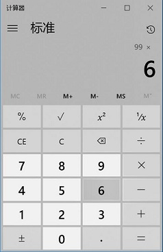
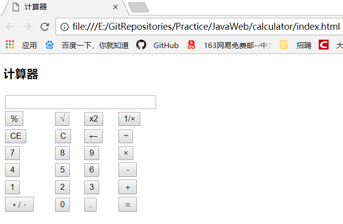
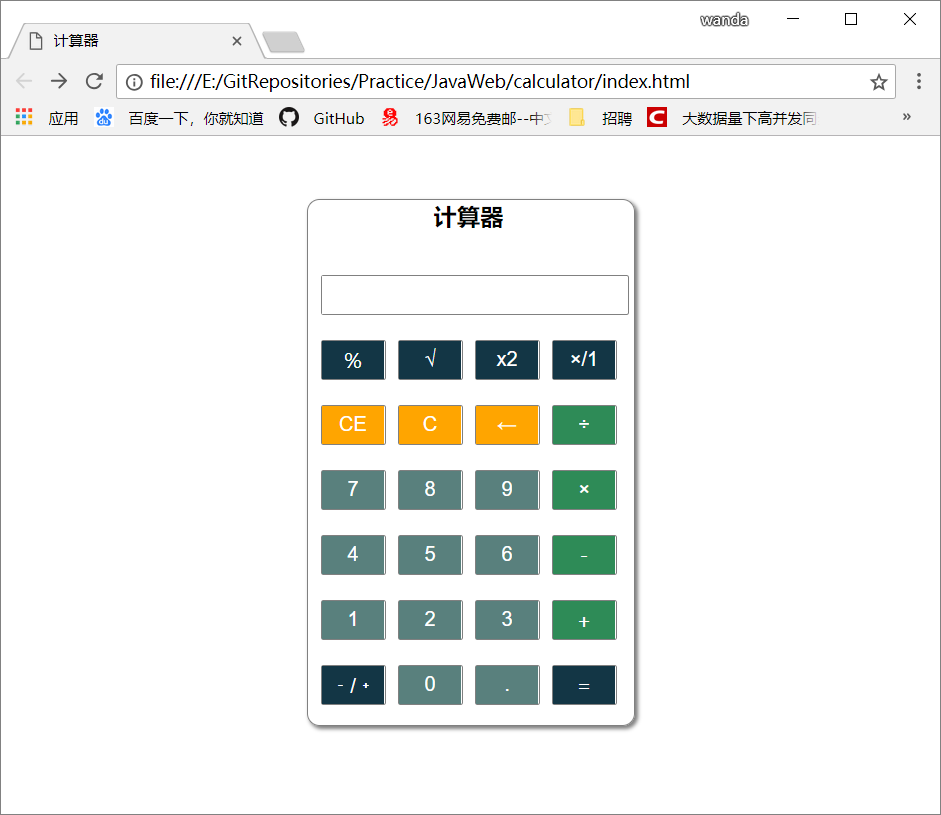

# Windows 计算器的实现

## 开发环境

* VSCode、HTML + CSS + JavaScript

## 理想结果图


*******************

## 开发思路

* 首先根据理想图，思考在 HTML 中如何简单的实现每个按钮，使基本该有的东西都有，该图首先有一个显示器，思考可以用一个 **只读的文本框** 实现，然后看到就是各种键盘按钮，思考可以用 **table** 标签或者 **div** 标签来实现，当然之后要涉及到每个按钮的事件，肯定会用到 **button** 标签。

* 基本按钮该有的都有了之后，就需要通过 CSS 来对 HTML 页面进行布局和样式渲染，使效果图接近理想的结果图

* 到了这一步，应该已经可以看到页面的效果图，只是还没有实现行为，即 button 的事件触发，这时候就要利用 JavaScript 了，通过 JavaScript 完成加减乘除、复位、开方、倒数、小数点、求余、计算等功能的实现

* 实现脚本与页面的分离，HTML 文件里面应该是纯净的 HTML 标签，所有或者大部分的样式都存放在外部的 CSS 文件中，所有或者大部分的行为都存放在外部的 JS 文件中，然后在 HTML 文件中引入外部 CSS 和 JS 文件，最终在达到目的的同时也实现脚本与页面的分离

## 开发过程

### 编写 HTML 页面

* 引入外部的文件（暂时为空）

```HTML
    <link rel="stylesheet" type="text/css" media="screen" href="mystyle.css" />
    <script type="text/javascript" src="main.js"></script>
```

* 将 body 里面的内容用适当的 div 进行布局，设置 div 的 id 方便在 CSS 文件中进行操作

```HTML
    <div id="calculator"></div>
```

* 用 table 标签以及 tr 和 td 和 input 标签简单的布置出每个按钮的位置

```HTML
    <tr>
        <td colspan="5"><input type="text" id="resultIpt" readonly="readonly" value="" size="17" maxlength="17"></td>
    </tr>
    <tr>
        <td><input type="button" value="％" class="btn_color2 btn_operation"></td>
        <td>......</td>
    </tr>
```

* 此时的效果图为：


*******************

* 跟最终的目标图相比，大概有的东西都有了，但是没有样式的页面很难看，所以下一步需要的就是对 HTML 文件进行样式布局

### 编写 CSS 文件

* 根据 div 的 id 对计算器进行总体的布局

```CSS
    #calculator{
        position: relative;                     /*定位计算器*/
        margin: 50px auto;                      /*设置外边距，浏览器自动计算*/
        width: 260px;                           /*宽度*/
        height: 420px;                          /*长度*/
        border: 1px solid gray;                 /*边框的样式：边宽、样式、颜色*/
        -webkit-border-radius: 10px;            /*圆角属性  兼容苹果、谷歌等浏览器*/
        -moz-border-radius: 10px;               /*圆角属性  兼容火狐浏览器*/
        border-radius: 10px;
        -webkit-box-shadow: 2px 2px 4px gray;   /*阴影效果*/
        -moz-box-shadow: 2px 2px 4px gray;
        box-shadow: 2px 2px 4px gray;
        behavior:url("ie-css3.htc");            /*IE8-*/
    }
```

* 对 input 标签对 button 按钮进行装饰（见源代码）

* 最后对细节做一些处理，比如标题啊、按钮颜色区分功能啊、等等

* 此刻的效果图为：


*******************

### 编写 JS 文件

* 定义变量

```javascript
    var resultIpt = document.getElementById("resultIpt"); //获取输出文本框
    ......
```

* 获取第一个数（见源码）

* 对获取的第一个数或者操作符进行判断，从而进行不同的操作

```javascript
    num1=parseFloat(resultIpt.value);
        oper = this.value;
        if(oper=="1/×"){
            num1 = Math.pow(num1,-1);           //取倒数
            resultIpt.value = num1.toString();
        }
    ......
```

* 定义一个计算函数

```javascript
    function calculate(num1, num2, oper) {
        switch (oper) {
            case "＋":
                result=floatAdd(num1, num2); //求和
                break;
            ......
        }
    }
```

* 运算方法的实现

```javascript
    function floatAdd(arg1,arg2){
    var r1,r2,m;
    try{r1=arg1.toString().split(".")[1].length}catch(e){r1=0}
    try{r2=arg2.toString().split(".")[1].length}catch(e){r2=0}
    m=Math.pow(10,Math.max(r1,r2));
    return (arg1*m+arg2*m)/m
    }
    ......
```

* 输出结果

* **暂时不会做动画演示图，请用浏览器打开 index.html 文件动手操作（暂有一个 bug：正负切换的时候负号是显示在文本框的右边，只影响可读性，但是不影响计算）**

## 收获

* 为准备这个项目的实现，对前端知识的 HTML、CSS、JavaScript 的基础知识和使用进行了了解

* 通过对这个小 demo 的练习，达到对前端技术结构的认识，以及对这几天自学的前端知识进行了应用