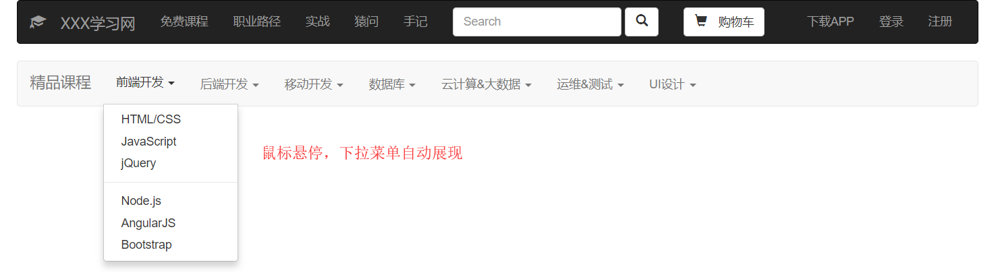

# 模拟慕课网首页

## 开发环境

* VSCode、HTML + CSS + BootStrap + JavaScript

## 理想结果图


*******************

## 开发过程

### bootstrap 的学习

* 以前没有接触过 bootstrap，这次首先对其内容、用法做了简单的了解，观看了教学视频，对着中文文档熟悉了 bootstrap 的一些基本样式和组件功能

* 然后根据理想图开始编写 HTML 页面

### 编写 HTML 页面

* 利用 bootstrap 的模板，创建 HTML 页面，主要包括 bootstrap 的引入

```HTML
    <!-- Bootstrap -->
    <link href="https://cdn.bootcss.com/bootstrap/3.3.7/css/bootstrap.min.css" rel="stylesheet">
    <!-- jQuery (Bootstrap 的所有 JavaScript 插件都依赖 jQuery，所以必须放在前边) -->
    <script src="https://cdn.bootcss.com/jquery/1.12.4/jquery.min.js"></script>
    <!-- 加载 Bootstrap 的所有 JavaScript 插件。你也可以根据需要只加载单个插件。 -->
    <script src="https://cdn.bootcss.com/bootstrap/3.3.7/js/bootstrap.min.js"></script>
```

* 根据实际图设计**导航条**，用到了 bootstrap 的 *.nav* 和 *.navbar* 类以及其中的一些样式（源码太长，这里不展示），效果图为：


*******************

* 实现**下拉菜单**，用到了 *.dropdown* 类，这里实现了在导航条里嵌套下拉菜单，然后鼠标悬停时下拉菜单自动展现，效果图为：


*******************

* 实现图片**淡入淡出**的滚动动态效果（效果见结果展示）

* 实现：点击下拉菜单中的超链接，在页面上显示不同的内容。用到了 *.tab-content* 类

* 实现超链接页面的展示时，用到了**栅格系统**和**缩略图**，已经实现的链接有：前端开发的 HTML/CSS、JavaScript 和后端开发的 Java ，效果图为：


*******************


*******************

### 编写 CSS 文件

* 适当调节一些细节的样式

### 编写 JS 文件

* 鼠标悬停自动出现下拉菜单和淡入淡出的动画需要 JavaScript 的行为操作

## 总结

* 为准备这个项目的实现，主要学习了 BootSrap，包括全局 CSS 样式以及一些组件

* 本项目涉及到：栅格系统、按钮、图片、字体图标、下拉菜单、导航条等等样式和组件

* 目前收获到的是对 BootSrap 的使用，其就是对一些样式，组件的封装，搭建好模板，然后就可以通过调用类来实现一些布局，很方便很强大

* 之前没有前端基础，本 demo 实现得比较粗糙，而且具体功能的实现还需要借助文档和百度，需要以后慢慢多练多熟悉