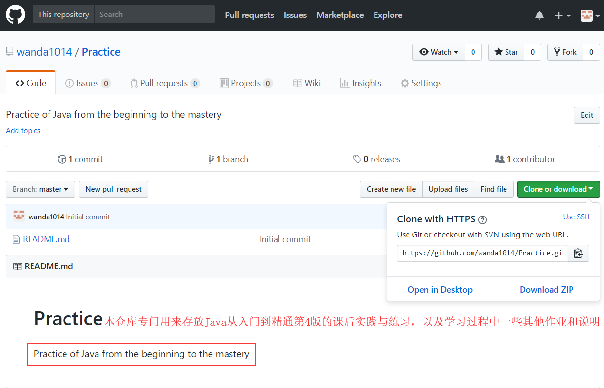
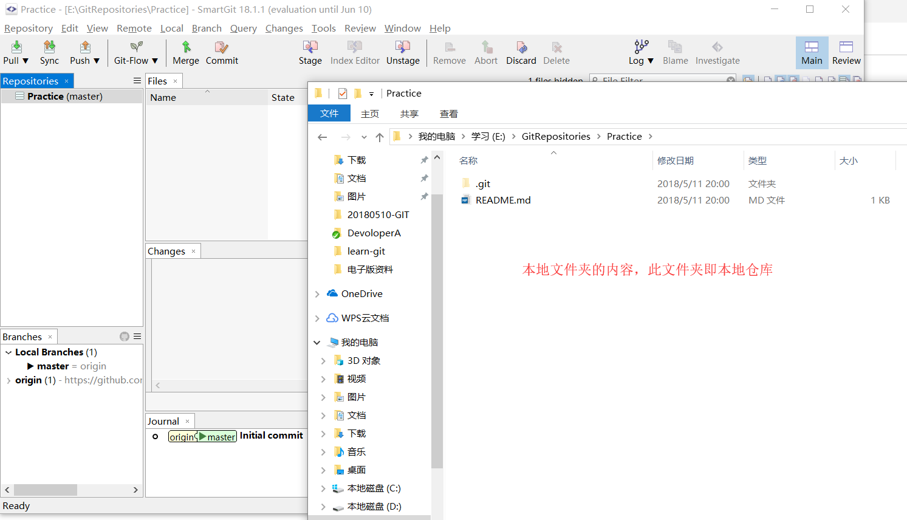
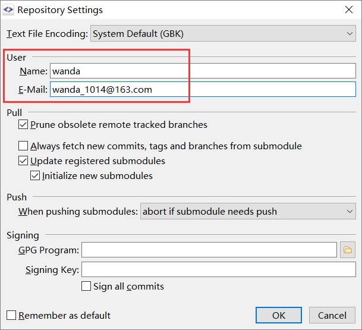
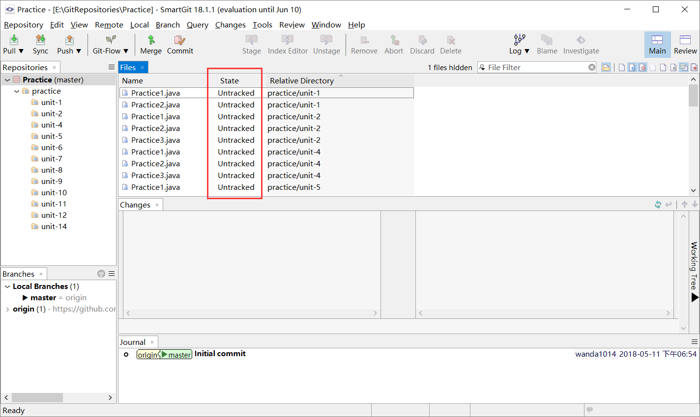
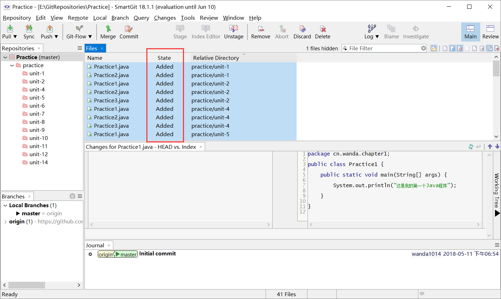
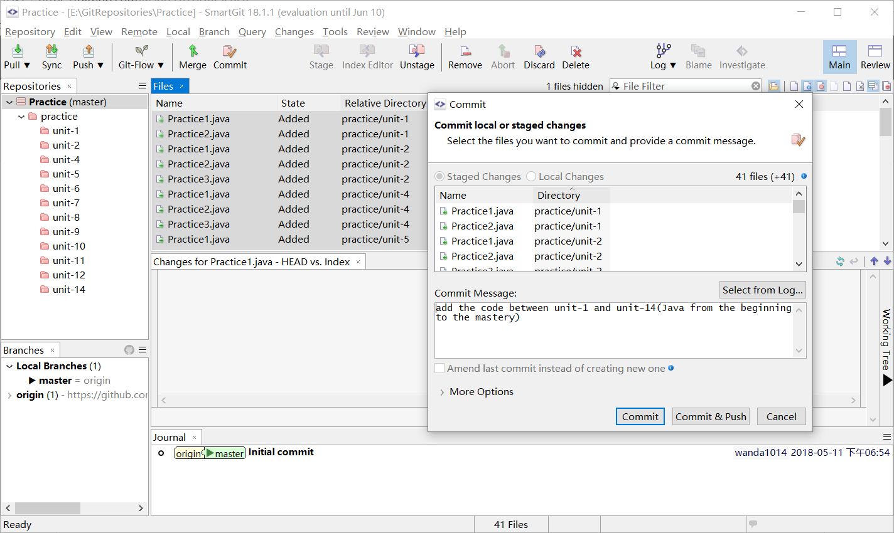
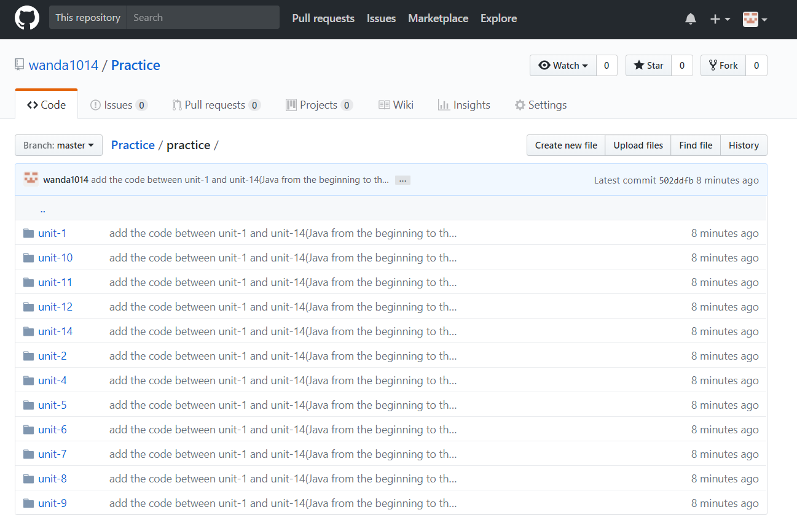
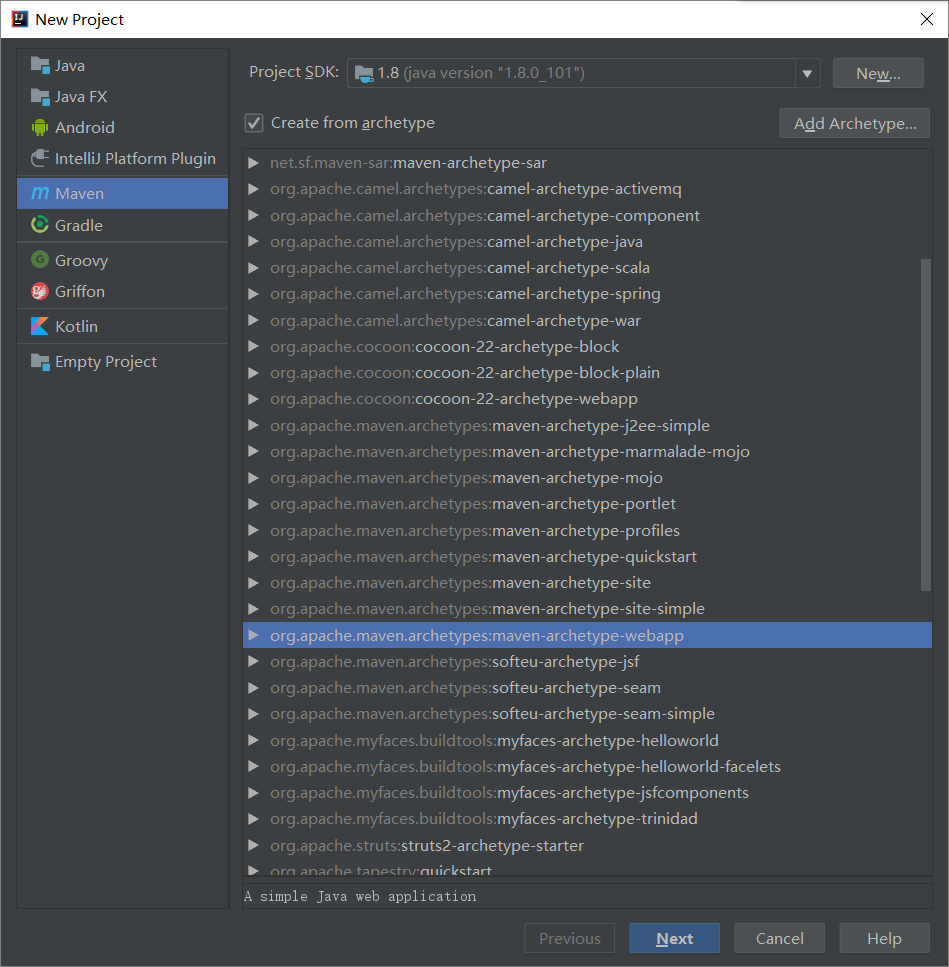

# 5.11工作内容

## git 和 smartgit 的学习

* github 远程仓库的创建


******************

* smartgit 创建本地仓库(`Repository -> Clone`)


******************

* 告诉 git 使用者信息(`Repository -> Settings`)


******************

* 将前两周完成的代码添加到本地仓库中（新建 practice 文件夹，专门用来存放 Java 从入门到精通第4版课后实践与练习的源代码）


******************

* 对新文件跟踪和暂存（`Stage`）


******************

* 提交内容到 smartgit（`Commit`）


******************

* 将修改的内容提交到网上，即远程仓库（`Push`）


******************

* **至此完成 smartgit 和 git 的基本操作，并且将之前使用 svn 管理的 Java 从入门到精通第4版的课后实践与练习的第1章到第14章的代码,转移到了本地的 smartgit 上，并 Push 上传到了 github 上。**

* **至于 git 的更多命令操作，在接下来的工作中会多次进行模拟熟悉**

## Java 的学习

* 通过对 Java 从精通到入门的第15章的学习，了解了以下功能的实现

文件的创建:

```java
    File out = new File("C:\\Users\\wanda\\Desktop\\test.txt");
```

向文件中写入内容:

```java
   FileWriter fw = new FileWriter(out);
   fw.write(a, 0, a.length);
   fw.close();
```

将文件中的内容读出:

```java
  FileReader fr = new FileReader(out);
  char[] b = new char[1024];
  int len = fr.read(b);
  System.out.println(new String(b,0, len));
```

设计到的类有：OutputStream、InputStream、FileReader、FileWriterd等等,完整的代码参考课后练习

## IDEA 社区版如何创建 Web 项目

* IDEA 社区版不能直接像 MyEclipse 那样直接创建一个JavaWeb项目,需要使用 Maven 来创建



* 好吧，失败告终！打算明天下载完整版的IDEA实现Web项目的创建

## 心得总结

### 学习过程

* 由于之前没有接触过 git，于是决定首先熟悉 git 的使用，最开始详细的阅读 *《 Pro Git》* 这本书的第一章到第三章，了解 git 的基本命令；然后简略的过一遍 *git-usage.md*,了解 smartgit 的简单使用；最后就是借鉴 CSDN 里面的一些博客，自己动手建立远程网上仓库和本地仓库，能够进行一些最基本的操作，方便以后每天将学习内容用 git 来进行管理

* 根据Java语言的要求任务，学习了 *《 Java从入门到精通第4版》* 第15章的学习，对输入输出流以及文件的有关操作进行了学习和巩固，并且通过课后的实践与练习进行了代码的编写

* 根据要求任务，想把 JavaWeb 项目的环境搭建起来，但是 IDEA 社区版的方法比较复杂而且尝试过好几次都以失败告终，于是明天准备用 IDEA 完整版来实现，为下阶段小系统的实现做好基础准备工作

### 总结

* 坚持每天使用 git，熟悉日常工作中的开发流程，养成好的提交习惯和规范

* 昨天和今天的效率比较低，原因其实是花费了不少时间去阅读资料和博客（由于之前没有 git 的相关基础，但是看书本对基础概念的了解还是有好处的，毕竟工具只是工具，底层思想了解清楚对以后的工作帮助也是很大的），基础还是看书本比较详细，博客讲的比较实用，可以适当的选择学习方法，致使效率最高，最终还是应该多动手和思考