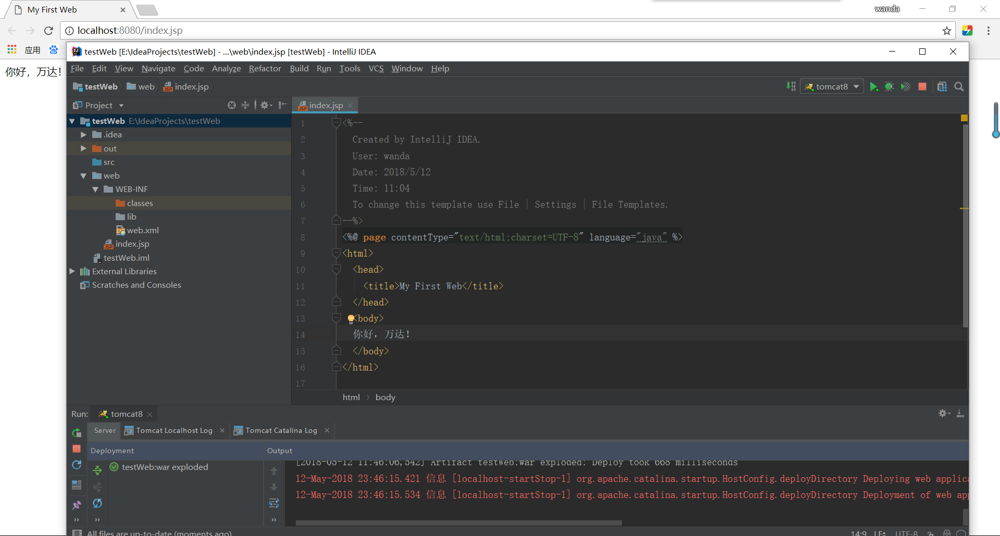

# 5.12工作内容

## Java 的学习

### 反射

* 构造方法的访问

```java
    objectClass.getConstructors();
    objectClass.getConstructors(Class<?>...parameterTypes);
    objectClass.getDeclaredConstructors();
    objectClass.getDeclaredConstructors(Class<?>...parameterTypes);
```

* 成员变量的访问

```java
    objectClass.getFields();
    objectClass.getFields(String name);
    objectClass.getDeclaredFields();
    objectClass.getDeclaredFields(Class<?>...parameterTypes);
```

* 方法的访问:

```java
    objectClass.getMethods();
    objectClass.getMethods(String name, Class<?>...parameterTypes);
    objectClass.getDeclaredMethods();
    objectClass.getDeclaredMethods(String name, Class<?>...parameterTypes);
```

* 课后实践与练习见 unit-16 (1.利用反射实现通用扩展数据长度的方法；2.利用反射初步验证用户输入的信息)

### 17章补充任务

* 从键盘输入文件的内容和要保存的文件名称，之后根据输入的名称创建文件，并将内容保存到文件之中(完整代码见 unit-17)，17章由于讲的是枚举和泛型，不用练习，平时可以锻炼，补充的习题是接着15章的内容的，考察对文件的操作。

### 多线程

* 实现线程的两种方式：(都需要实现 *run()* 方法)

```java
    public class ThreadTest extends Thread(){
    }
```

```java
    public class ThreadTest implements Runnable(){
    }
```

* 线程的休眠

```java
   try{
     sleep(1000);//线程休眠1000毫秒
   }catch(Exception e){
     e.printStackTrace();
   }
```

* 线程的加入

```java
    ThreadA.join();
```

* 线程的同步

```java
    public synchronized void add(){
      if(num > 0){
        try{
          sleep(1000);
        }catch(Exception e)V{
          e.printStackTrace();
        }
      }
    }
```

* 综合练习：设计四个线程对象，两个线程执行减操作，两个线程执行加操作（见 unit-18）

## IDEA 创建 Web 项目

* 下载安装 IDEA UItimate 版

* 创建新的工程（Web Application）

* WEB-INF下创建 classes 和 lib 文件夹，配置编译路径和lib路径，选择刚才创建的 classes 和 lib 文件夹

* 配置 tomcat，添加项目

* 启动 tomcat，运行 Web 项目，效果如下：


******************

## 心得总结

### 学习过程

* 接着昨天未解决的问题（IDEA做Web不方便），今天使用IDEA UItimate创建了Web工程并且实现了简单的jsp页面和浏览器的显示，为下一步开发JavaWeb项目打下了基础（之前没用过IDEA开发工具，因此很多功能需要重头学习）。

* 根据Java语言的要求任务，学习了 *《 Java从入门到精通第4版》* 第16、17、18章的学习，对反射的有关内容进行了学习和巩固，泛型要求平时锻炼，还对线程的使用进行了学习和巩固。

* 根据 Java 语言的要求任务，通过对课后实践与练习的完成来检验今天的学习内容，源代码见 unit-16, unit-17 和 unit-18.

### 总结与下一步打算

* 今天的学习内容就是书本上内容的学习，和 Web 项目的搭建

* 由于第20章的内容涉及到数据库的操作，以后后面小 demo 想用数据库进行操作，因此明天的首要任务就是先熟悉数据库 postgresql。然后可以完成书本的学习，有多的时间可以试一试数据库的增删改查。