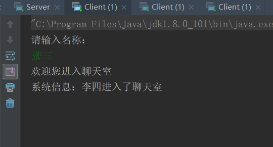

# 5.12工作内容

## Java 的学习

### 网络通信

* 获取主机名、主机地址和本机地址

```java
    InetAddress ip = InetAddress.getByName("localhost");
    System.out.println("主机名：" + ip.getHostName());
    System.out.println("主机地址：" + ip.getHostAddress());
    System.out.println("本机地址：" + InetAddress.getLocalHost().getHostAddress());
```

* 服务器与客户端简单的信息交互

```java
    //创建服务器端
    ServerSocket serverSocket = new ServerSocket(8001);
    //等待客户端连接
    Socket client = serverSocket.accept();
    //服务端输入输出流
    DataInputStream dis = new DataInputStream(client.getInputStream());
    DataOutputStream dos = new DataOutputStream(client.getOutputStream());
    //通过对流的操作实现与客户端的交互
```

```java
    //创建客户端
    Socket client = new Socket("localhost",8001);
    //客户端输入输出流
    DataInputStream dis = new DataInputStream(client.getInputStream());
    DataOutputStream dos = new DataOutputStream(client.getOutputStream());
    //通过对流的操作实现与服务器端的交互
```

* 聊天室的实现:Receive类用来实现接收数据；Send类用来实现发送数据；CloseUtil类用来关闭流；Server为服务器端，实现了一个客户端对应一条通道，并对系统信息和聊天信息以及私聊信息进行了处理；Client为客户端，多次运行，每次运行提示输入客户名称，用来模拟多人聊天室。源代码见 unit-19 效果如下：


******************


******************


******************


******************


******************


******************


******************


******************


******************

* 课后实践与练习的详细代码见 unit-19

### 数据库操作(基于 postgresql 数据库)

* postgresql 学习网址：<https://www.cnblogs.com/stephen-liu74/archive/2012/06/08/2315679.html>

创建表

```sql
  CREATE TABLE tb_emp (
  id SERIAL,
  name text DEFAULT NULL,
  sex text DEFAULT NULL,
  birthday date DEFAULT NULL,
  dapt text DEFAULT NULL,
PRIMARY KEY (id)
)
```

可视化工具：Navicate


******************

* 导入连接数据的 jar 包

*postgresql-42.1.1jre6.jar*

* 连接数据库

```java
    /得到连接的方法
    static Connection con;
    public Connection getConnection() {
        try {
            Class.forName("org.postgresql.Driver");
            con = DriverManager.getConnection("jdbc:postgresql://localhost:5432/db_test",
                    "postgres", "123");
 //         System.out.println("连接成功");
        } catch (Exception e) {
            e.printStackTrace();
        }
        return con;
    }
```

* 向数据库发送 sql

```java
    sql = con.createStatement();
```

* 得到结果集以及遍历结果集

```java
    //得到结果集
     rs = sql.executeQuery("select * from tb_emp where dapt = '销售部'");

     //遍历结果集
    while (rs.next()){
        String id = rs.getString(1);
        String name = rs.getString("name");
        String sex = rs.getString("sex");
        String birthday = rs.getString("birthday");
        String dapt = rs.getString("dapt");
        //输出信息
         System.out.println(id +"\t" + name +"\t" + sex +"\t" + birthday +"\t" + dapt);
    }
```

* 预处理

```java
    sql = con.prepareStatement("insert into tb_stu(name,sex,birthday) values(?,?,?)");
```

* 完整的代码见 unit-20

## 心得总结

### 学习过程

* 根据昨晚的打算，首先对 postgresql 进行了学习，包括：软件及其可视化工具的安装与配置、建数据库、建表、字段的常用数据类型以及表的增删改查 sql 语句，并且发现 postgresql 的 sql 语句与 mysql 的 sql 语句有细微的差别，以后要注意。

* 根据Java语言的要求任务，学习了 *《 Java从入门到精通第4版》* 第19、20章的学习，对网络通信和数据库操作进行了学习与巩固，其中数据库操作主要以 JDBC 为主。

* 根据 Java 语言的要求任务，通过对课后实践与练习的完成来检验今天的学习内容，源代码见 unit-19 和 unit-20.

### 总结与下一步打算

* 到今天为止，对 Java 语言基础的学习已经全部完成

* 明天首先根据学习任务，来开始对前段时间的学习和以前掌握的 Web 相关的知识进行梳理和校验。