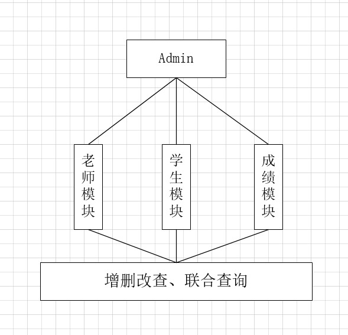
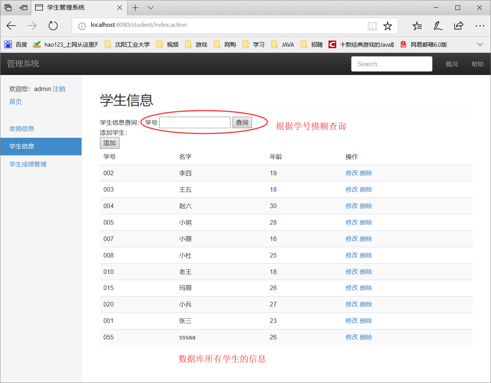

# 5.12工作内容(学生管理系统的实现)

## 开发环境

* IDEA 2018

* JDK 1.8

* Tomcat8

* maven3 + spring4 + springmvc + mybatis3 + postgresql

## 总体介绍

* 本系统用于高校的后台管理系统，admin是最高权限的管理员

* 暂时只有简单的三个模块：**老师模块**、**学生模块**、**学生成绩模块**

* 管理员模块：做了一个简单的登录验证和退出登录

* 老师模块：暂时只实现了老师的查找功能

* 学生模块：实现了学生信息的增删改查功能，其中用到了页面的数据回显，springmvc的ModelAndView来简化数据交互，数据方面用到了模糊查询

* 学生成绩模块：实现了学生表和分数表的联合查询

## 简易流程图

******************

## 具体实现

* 用Maven来构建工程，在此过程中查看了不少资料，maven对jar包的管理比较先进

* 向工程中导包(即配置pom.xml)、配置Tomcat服务器

* 创建项目包名以及各种目录

******************

* ssm框架的配置文件beans.xml、springmvc.xml、sqlMapconfig.xml以及db.properties、log4j.properties

* 有层次的建包名包括：controller、entity、mapper、service、util

* 开发工作源代码时间有限，不贴出来，见工程目录

## 效果演示

### 管理员模块

* <http://localhost:8080/>或者<http://localhost:8080/index.jsp>进入登录页面，数据库暂时只设置了 username : admin ; password : admin 一个管理员

******************

******************

### 老师模块(点击老师信息)

******************

### 学生模块(做得比较详细)

* 查询功能，进去默认查询所有

******************

******************

* 修改功能(点击修改，自带学号进入修改页面，**之前是正确实现了，但是现在演示出错，先将本文档，晚上自己再调一调**)

******************

* 添加和删除均已实现

******************

### 成绩模块

******************

******************

******************

******************

## 工作总结和遇到的问题

* postgresql 是第一次接触，花了部分时间熟悉其简单的 SQL 语句

* maven 是第一次接触，花了部分时间解决 IDEA 用 maven 建 Web 工程，以及熟悉其配置，从而完成 Web 项目的运行

* 整个系统基于 spring + spingmvc + mybatis 实现，涉及到 sringmvc 与 mybatis 的整合、springmvc 与 jsp 页面的数据交互、spring 核心框架是如何在项目中起到作用的等等问题

* 整个系统的逻辑还是比较简单的，但是设计到一些之前没学过的知识，然后也借助此项目将之前的部分知识点进行了复习，详细代码见项目工程 stuManage.

* 源代码中有些代码的注释也得不够详细，controller的注释已完善，mapper和service的注释先提交本文档再完善